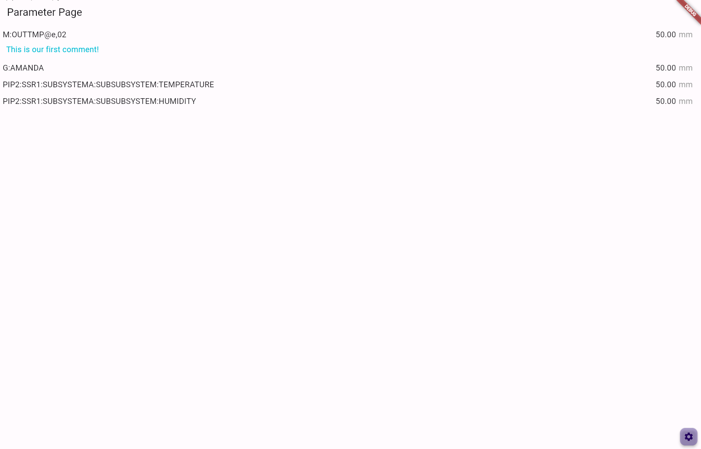

# PIP-II Parameter Page Web Application



This is the PIP-II Parameter Page web application.

## Development Environment

The application depends on configuration in a .env file.  This file contains secrets so it is not tracked in this repository.  An example .env-test file is used to generate a .env with default values for testing.  You will need to do this in your development environment:

```
cp .env-test .env
```

If you need the production configuration, ask another developer or devops engineer.

## Running

To run the application in Chrome:

```
flutter run -d chrome
```

## Unit tests

Lowest-level tests organized around classes or modules.

To run:

```
flutter test test/unit_tests
```

## Widget tests

Tests at the Widget level without needing a heavy environment.

To run:

```
flutter test test/widget_tests
```

## Integration tests (UI Tests)

High-level tests that execute through the user inteface. Requires chromedriver to run. Tests are organized into a group for each user story.

Get chromedriver from: https://chromedriver.chromium.org/downloads

Start chromedriver on port 4444 (on my Windows machine I have chromedriver installed to C:\chromedriver_win32):

```
C:\chromedriver_win32\chromedriver.exe --port=4444
```

Run tests:

Note: each test file needs to be invoked manually. Replace display_parameter_page_test.dart with the test group you want to run.

-   In browser: `flutter drive --driver=test_driver/integration_test.dart --target=test/integration_tests/display_parameter_page_test.dart -d chrome`

-   Or headless: `flutter drive --driver=test_driver/integration_test.dart --target=test/integration_tests/display_parameter_page_test -d web-server`

## Integration tests (Service Tests)

This set of integration tests is designed to ensure compatibility with external services, including APIs and gRPC. Before running the tests, make sure to deploy the required services that you intend to test against and change .env file to point to the testing API instance.

Run tests:

```
flutter test test/service_tests
```

Note:  For Kubernetes environments, the integration testing is encapsulated within `Dockerfile.test`. This Dockerfile can be leveraged to facilitate integration testing seamlessly within a Kubernetes cluster.